# Lab 1
## Aplikacja startowa: kalkulator
### Stworzona za pomocą Android Developers
Widok startowy aplikacji:  
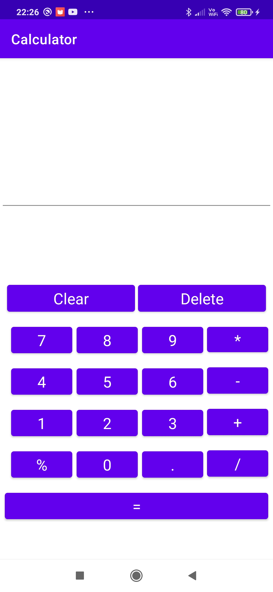  
Funkcje wpisujące numery oraz kropkę:  
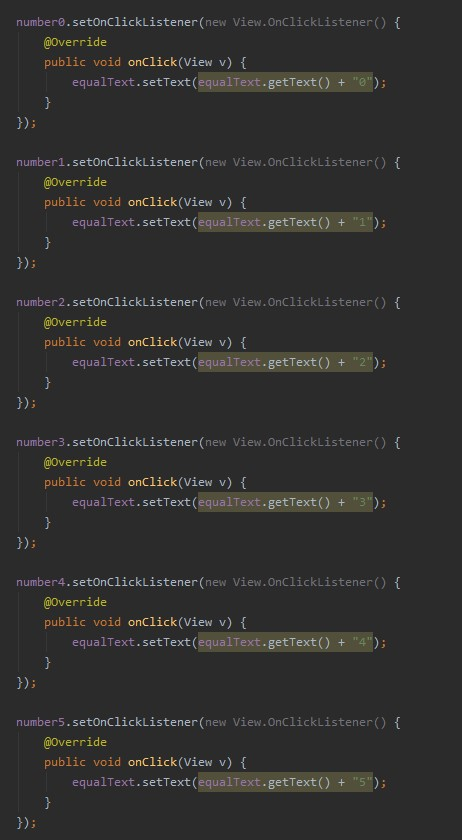  
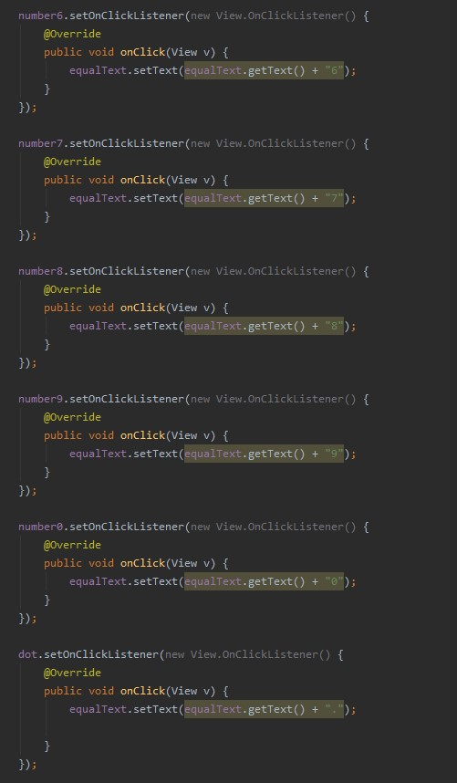  
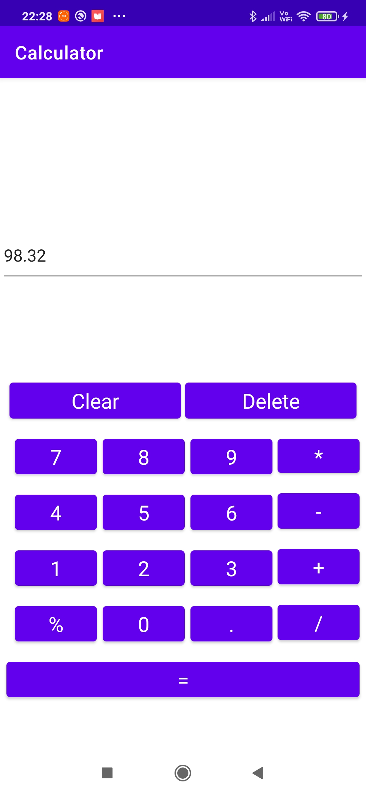  
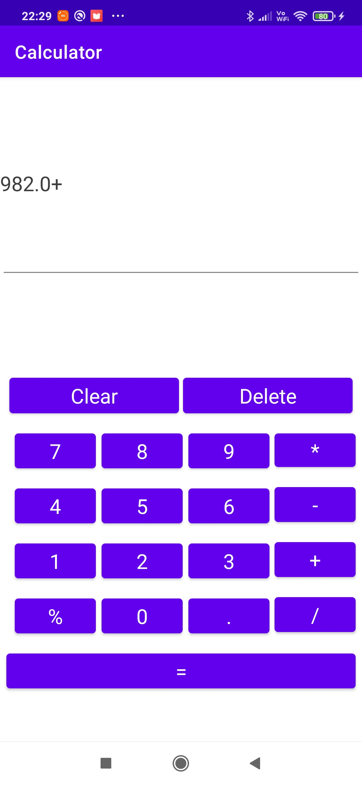  
Funkcja kasująca ostatnią wpisaną liczbę:  
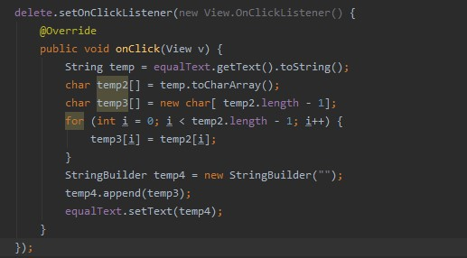  
  
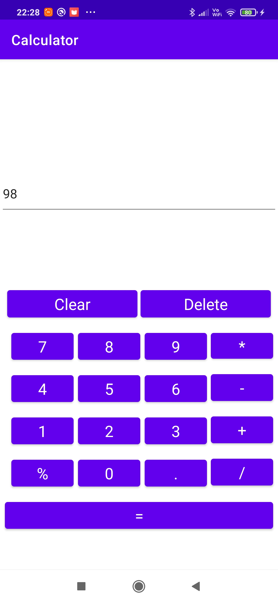  
Funkcja czyszcząca całość kalkulatora:  
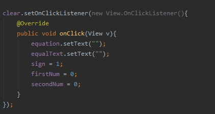  
  
Funkcja wykonująca ostatnie równanie i wypisująca wynik:  
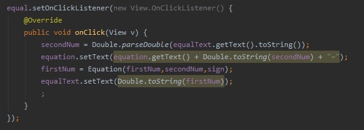  
Funkcja dodawanie:  
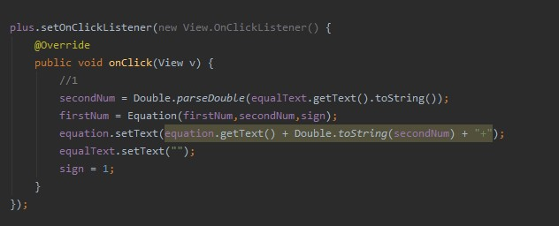  
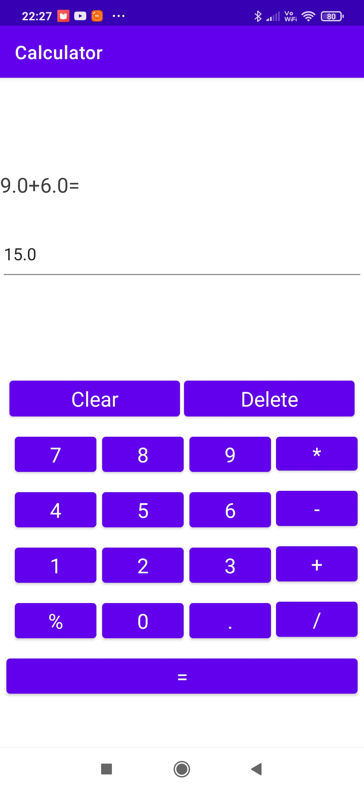  
Funkcja odejmowanie:  
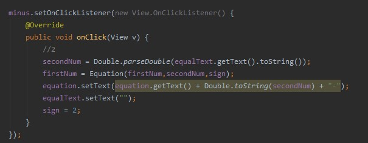  
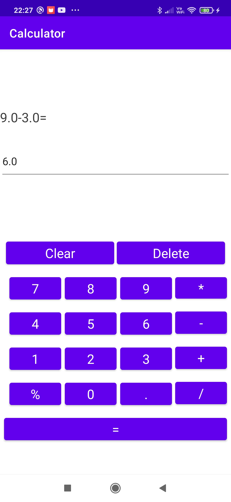  
Funkcja mnożenie:  
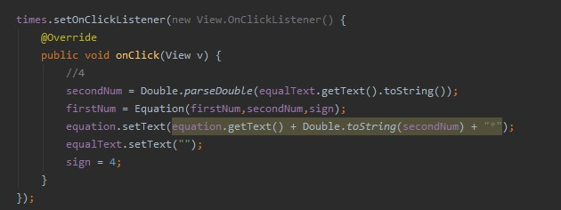  
  
Funkcja dzielenie:  
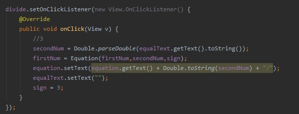  
  
Funkcja zmieniająca liczbę na wartość procentową:  
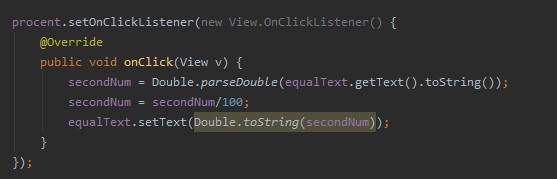  
  
  
Funkcja wykonująca obliczenia:  
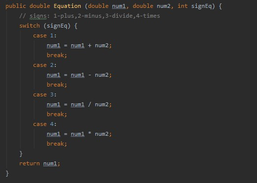  