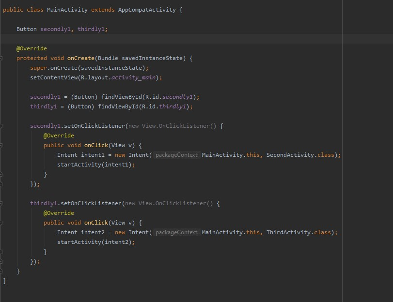
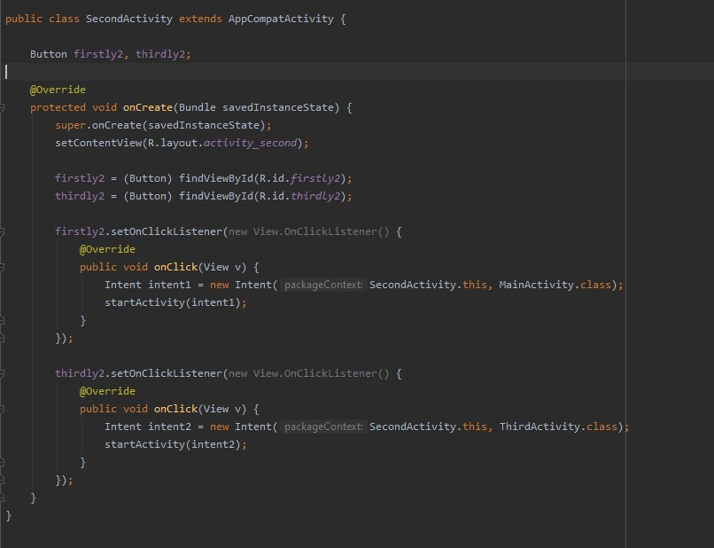
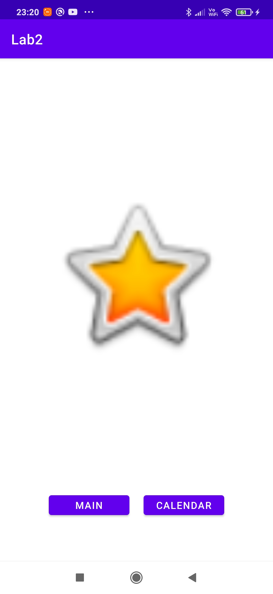

# Lab 2
## Responsywne layouty + nawigacja
**Pierwszy ekran**  
Funkcje  
  
Wygląd  
  
**Drugi ekran**  
Funkcje  
 
Wygląd  
  
**Trzeci ekran**  
Funkcje  
  
Wygląd  
  
Nawigacja odbywa się za pomocą przycisków na każdym z ekranów  
**Responsywność**  
Ustawia się ją w tym miejscu w projekcie wyglądu aplikacji, linie na obrazku w środku oznaczają, że wielkość danego elementu jest zależna od wielkości ekranu urządzenia.
  
A w ten sposób wygląda to w kodzie. Marginy oznaczają jakie są odległości od wybranych elementów bądź od krawędzi ekranu."layout_constraint..." pokazują od których elementów bądź boków aplikacji jest mierzona odległość marginesów. Jak widać na screenie wybrany element od trzech stron (boków i góry) jest uzależniony od wielkości telefony a dolny margines jest odmierzany od innego elementu. 
  