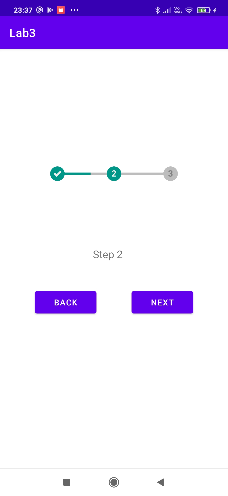

# Lab 3
## renderowanie listy danych + obsługa progresu
  
### Pierwszy ekran :lista  
Generowanie listy pseudolosowych liczb  
  
  
Inicjalizacja adaptera do ListView  
  
Widok wygenerowanej listy nieposortowanej  
  
Sortowanie i filtrowanie liczb  
  
  
  
### Drugi ekran : lasy-loading  
Widoki:  
Pierwotna lista  
  
Ładowanie kolejnych elementów listy  
  
Lista po załadowaniu  
  
Kod:  
Stworzony adapter:  
  
  
  
Początek klasy aktywności:  
  
Funcje: iniscjalizacja adaptera, inicjalizacja Scrolla, załadowanie większej ilości elementów  
  
  
Wygląd ładowania  
  
Wygląd elementów listy  
  

### Trzeci, czwarty, piąty ekran: steps  
Widoki:  
Step 1:  
  
Step 2:  
  
  
Step 3:  
  
  
ProgressBar:  
  

