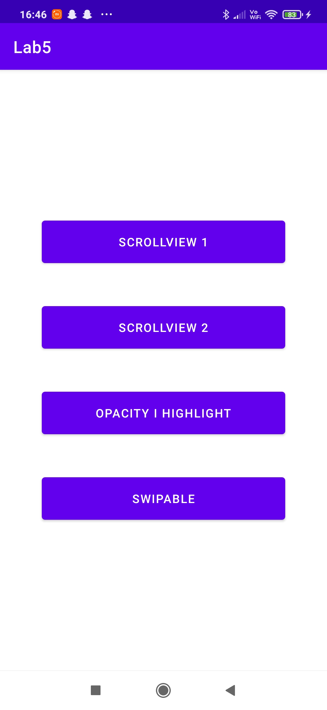
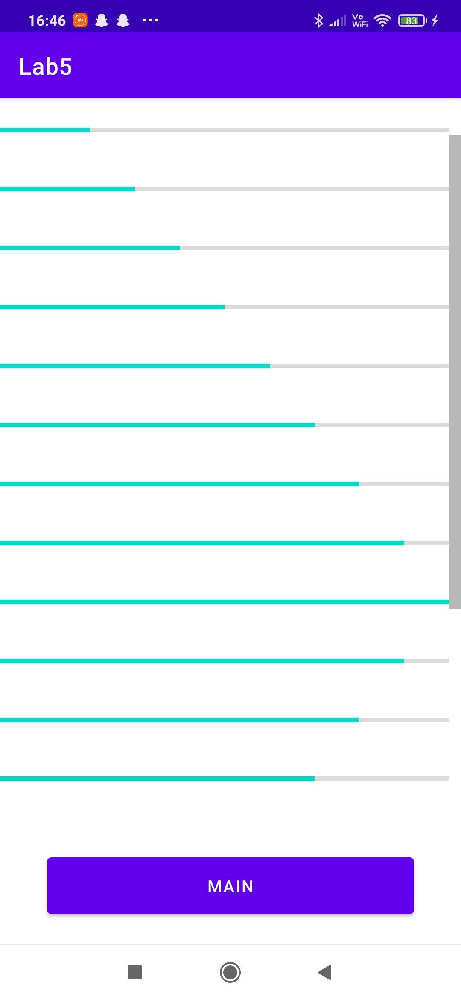
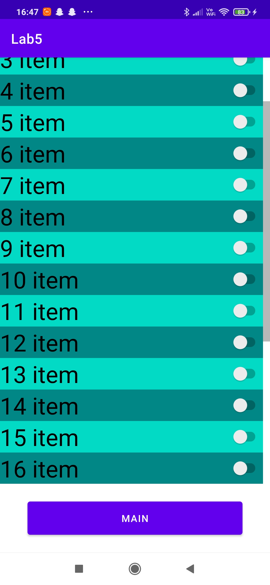
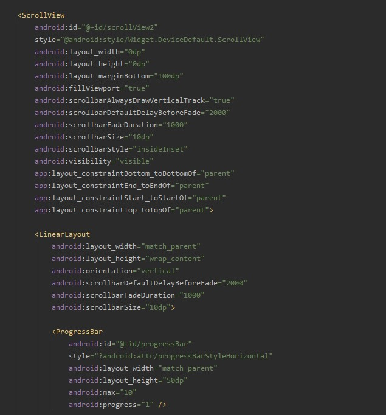
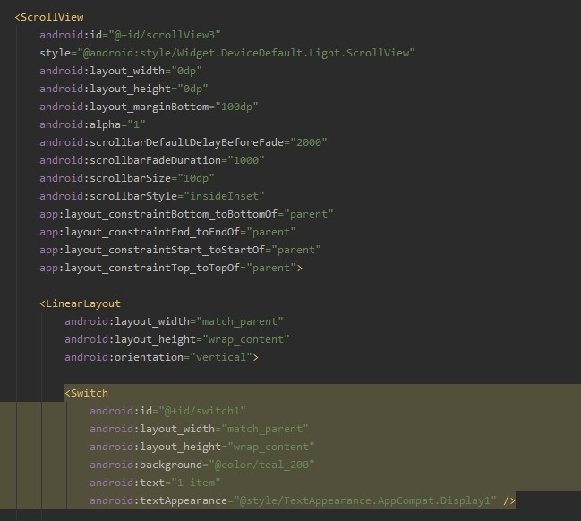
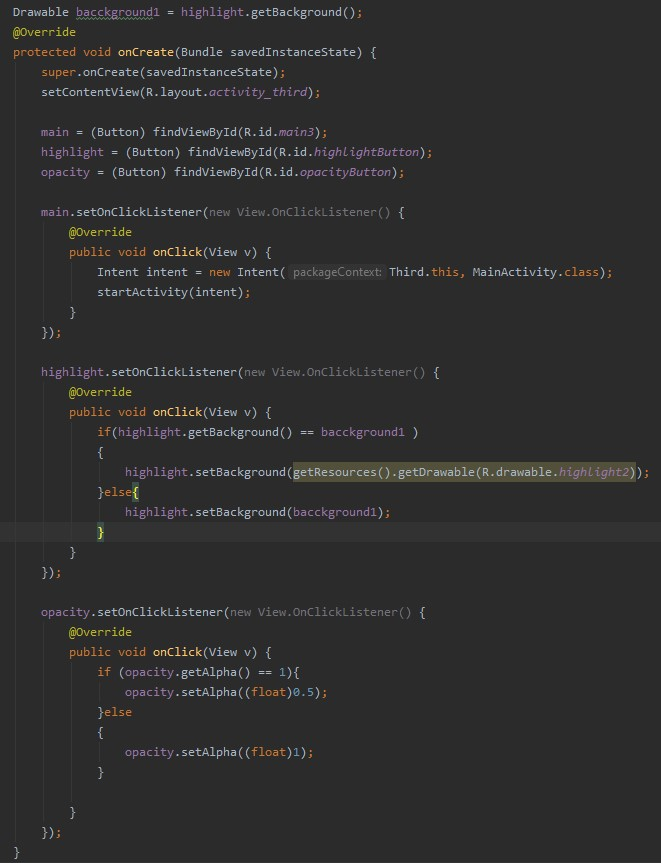
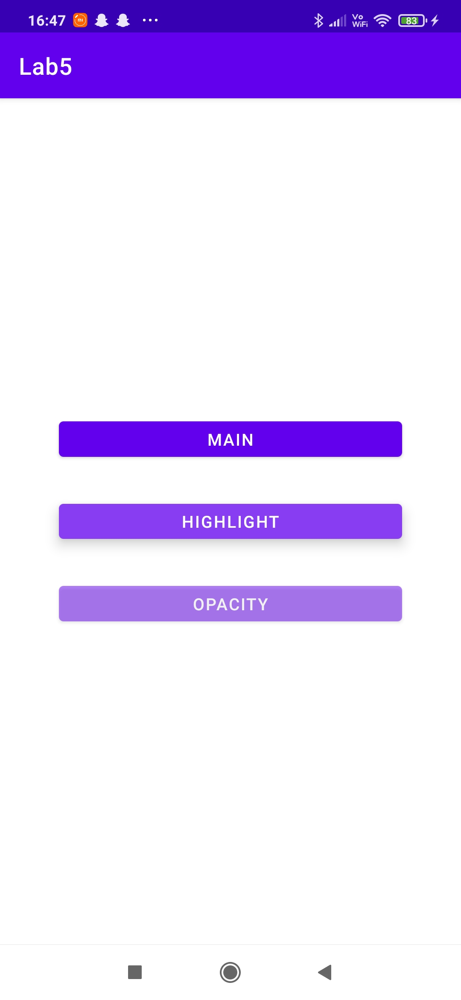
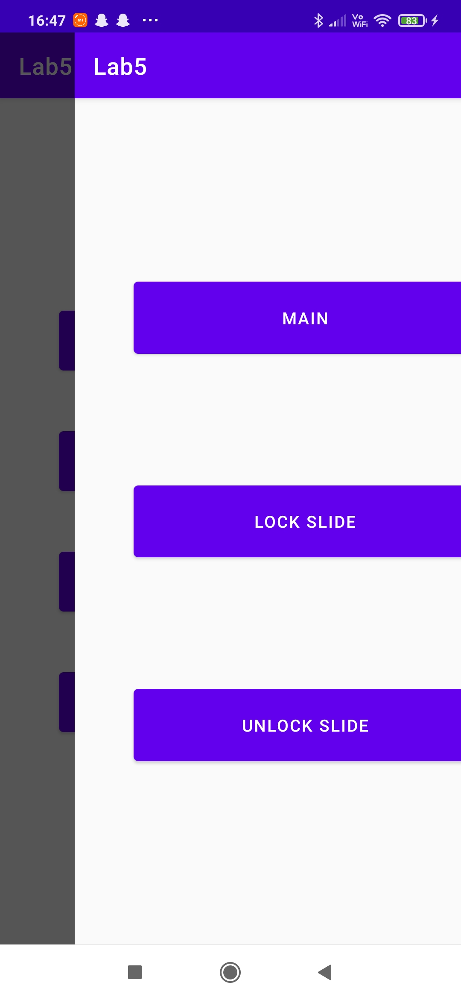
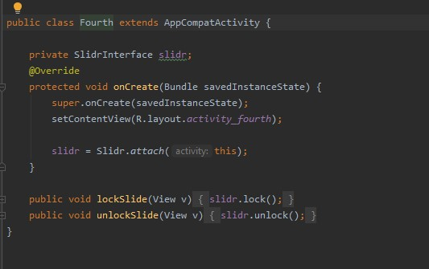
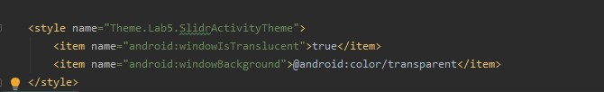

# Lab 5

na pierwszym i na drugim ekranie należy zaimplementować użycie komponentu ScrollView, na każdym z nich powinnny być różne style (Flexbox) oraz widoczny pasek przewijania (scrollbar)

na trzecim ekranie należy zaimplementować użycie komponentów TouchableOpacity i TouchableHighlight; na ➕ można pokusić się o użycie komponentu WebView po naciśnięciu przycisku,

na czwartym ekranie należy zaimplementować obsługę przesunięć palcem (komponent Swipeable);

