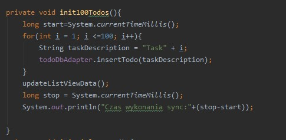
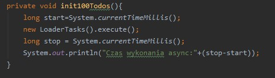
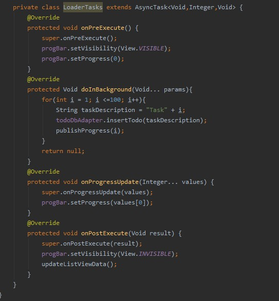
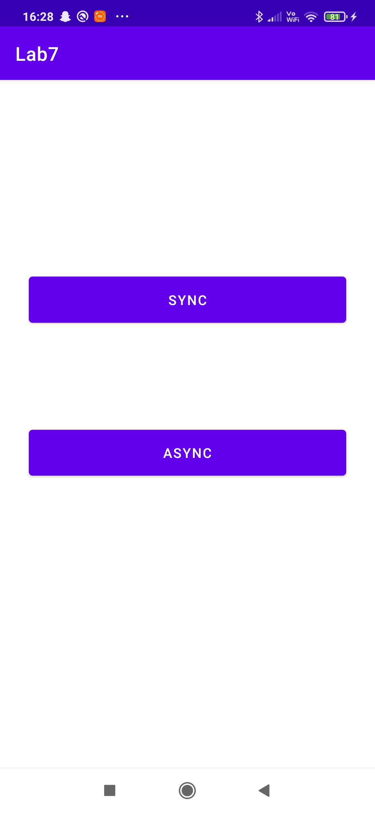
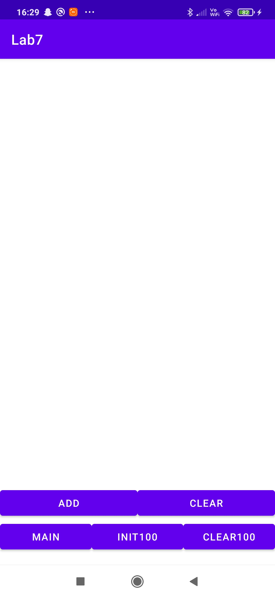
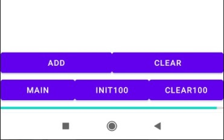
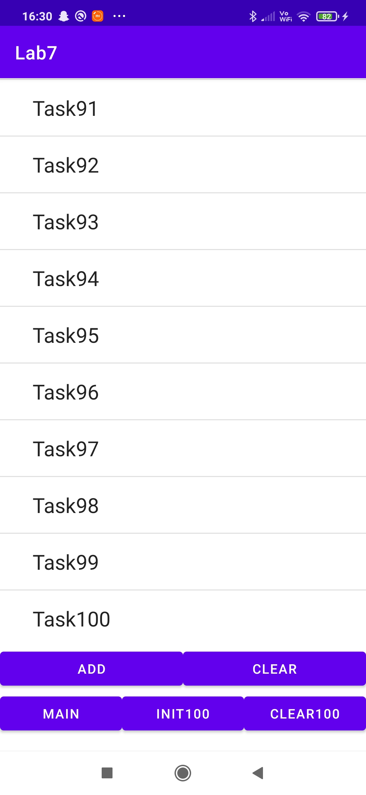

# Lab 7
Kod z lab 6 został tu rozszerzony
Funkcja synchroniczna

Czas wykonania

Funkcja asynchroniczna

Czas wykonania

Wygląd:

Wygląd obu zakładek

Ładowanie 100 tasków przyciskiem Init100 (tylko przy asynchronicznym)

Załadowane 100 tasków
