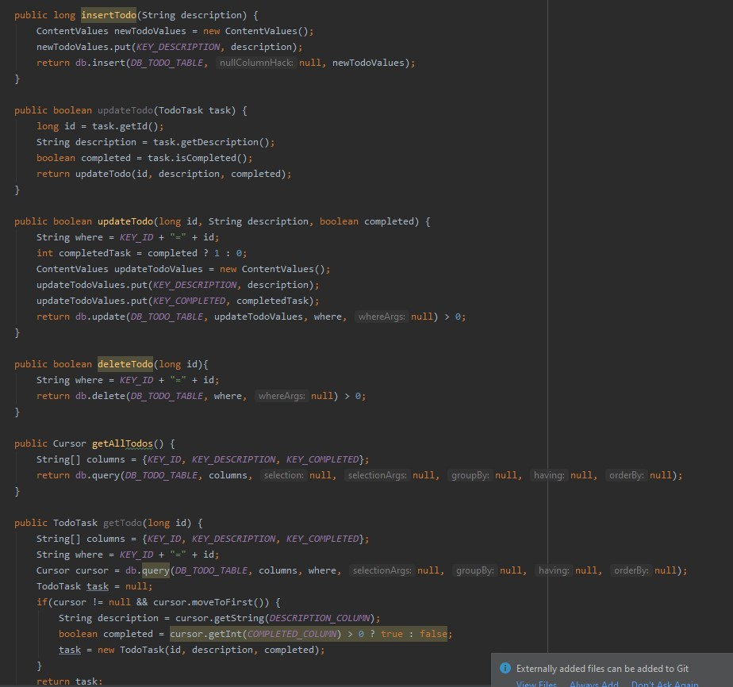

# Lab6
## Baza danych SQLite i Kursory
### Kod
Adapter bazy danych  
  
  
Klasa TodoTask  
  
Adapter Task  
  
Główna aplikacja  
  
  
  
  

### Wygląd aplikacji
  
po kliknięci w przycisk Add  
  
  

Po kliknięciu na task  

Po kliknięciu w przycisk clear  

Jeśli w tym momencie nacisnie się Cancel to wrócimy do poprzedniego widoku  
